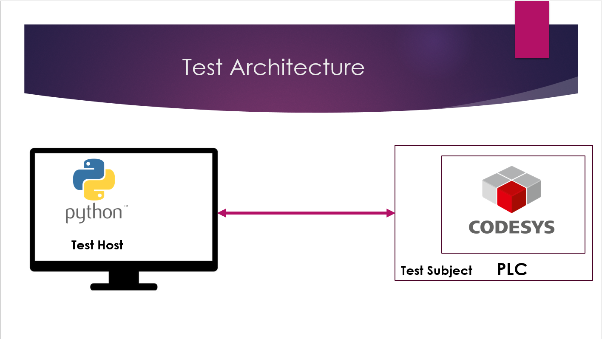

## PLC Automated Testing
 This project aims to develop PLC Automated Tests for Industrial Automation Applications. The Automated testing utilizes different technologies to accomplish an Automated method, to Test PLC Software.

Automated tests run on a separate device and are written in python using the pytest framework. The Automated tests will cover unit testing, Integration testing and Acceptance testing. Test cases will also include testing of different industrial communication protocols including Modbus, OPC UA, Socket, HTTP and REST


### Test Architecture

- Tests are written and run on a seperate device reffered to as the ```Test Host```
- TheTest Host configures the ```Test Subject``` and then sets different test cases by setting different paramters on the Test Subject
- Tests are written in python with help of the pytest Library
- To communicate with the Test Subject to set paramters and read results, the Test Host uses a vraity of technologies and communitaion cahhles which include Modbus, OPC UA, TCP Sockets and many others


### The PLC application
- There is simple PLC application developed in codesys with version 3.5SP19 patch 5. You will need Codesys 3.5SP19 patch 5 or higher to open the application
- The PLC used is a Codesys Control Win V3. Replce the Deice with your own controller


### Prerequists
- Install python. Use Python 2.7 or higher
- Install pip
- Support libraries found in the ```requirements.txt file```. Use command ```pip3 install -r requirments.txt```

### Instructions 
- Configure your test subject parameters by editing the ```pytest.ini``` file.
- Required parameters include the PLC ip address, Communication ports and other important information required to run tests
- Tests cases are written in test scripts inside the ```.\tests\``` folder. Test scripts have descriptive names indicating component is being tested
- To run a single test script, use the following command: ```python3 -m pytest .\test\script.py```. Replace script with the script name
- To run all tests , simply use the following command: ```python3 -m pytest .\test\```